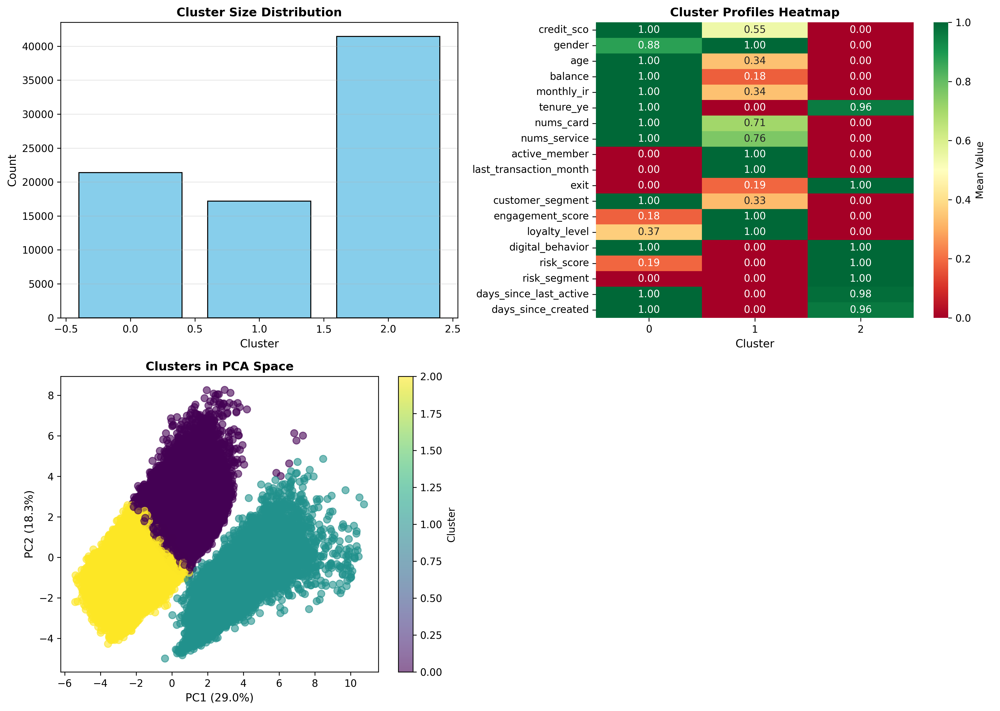
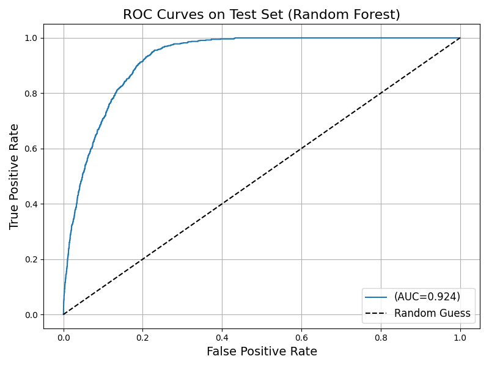

# Credit Risk Prediction App (Data from Vietnam Retail Banking)

## Overview

This project develops a **Credit Risk Prediction Model** using a synthetic retail banking dataset representing customers from Vietnam banks. The goal is to identify **high-risk customers** to support better credit decisions and risk management.

The trained model is deployed as an **interactive Streamlit web app**, allowing users to input customer data and receive real-time risk predictions.

Unsupervised leaning is used to explore natural clusters of banking customers. Discovered 3 groups of customers with distinct traits

Shap analysis and tree-rule visualizatoin are performed after random forest model traning to enhance intepretability

**Live Demo:** https://hannanguyencreditriskmodel.streamlit.app
---

## Dataset

This dataset contains **80,000 synthetic retail banking customer records** with realistic financial behavior simulation.

Features include:

- Demographic information  
- Financial data and account balance  
- Service usage and behavioral activity  
- Credit risk labels   

All records are claimed to be fully synthetic and generated programmatically based on real data from Vietnam retail banks

---

## Project Workflow

### 1. Exploratory Data Analysis (EDA)

Performed EDA and data visualization to understand:

- Feature distributions  
- Risk class imbalance  

### 2. Data Preprocessing

- Encoded categorical features (binary and ordinal encoding)  
- Selected most predictive features using **Mutual Information (MI)**  

Final top 8 features used in the model and app:

- `last_transaction_month` — total transaction amount last month  
- `days_since_last_active`  
- `active_member`  
- `digital_behavior`  
- `nums_service`  
- `balance`  
- `customer_segment`  
- `monthly_ir`  

---

### 3. Model Training and Selection

***Unsupervised Learning***

- Use Elbow Method and Silhouette Scores to determine best k
- K-mean algorithms (k=3) combined with heatmap and cpa visualization
- Result:
   
   ===== Cluster 0: The Elites" ====== 

- Highest-value customers, but disengaged.

- Have the highest balance, credit_sco, and monthly_ir but lowest active_member score, low engagement, and not using mobile app

- <mark> The most high-value segment <mark>

   ===== Cluster 1: The Loyal" ====== 

- Highest active_member, engagement_score, loyalty_level, using mobile app, lowest days_since_last_active

- Having low account balance and monthly_ir

- <mark> The most stable segment <mark>

   ===== Cluster 2: The High-risk" ====== 

- Have the highest exit (churn) rate, risk_score, and risk_segment

- They have the lowest balance, credit_sco, and monthly_ir

- Younger or lower-income users, active on digital apps but are very likely to leave

- <mark> The most fragile segment <mark>

***Supervised Learning***

Compared multiple tree-based models:

- Random Forest  
- XGBoost  
- Extra Trees  

Used **RandomizedSearchCV** for hyperparameter tuning.

Final selected model: **Random Forest Classifier**

---

## Model Performance

Test set performance:

- **ROC-AUC:** 0.924  
- **Precision:** 23.68%  
- **Recall:** 93.01%  

Recall was prioritized to minimize false negatives and ensure high-risk customers are detected.

---

## Model Intepretation

- check rf_interpretability folder

## Deployment

The trained model was exported using joblib and embedded in an interactive web app using Streamlit with:

- Risk probability score
- Interactive interface

